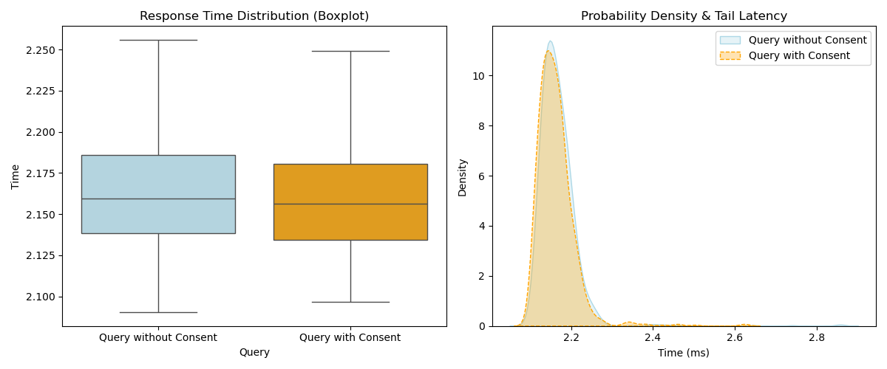

# Demonstrator for the BBMRI.it Pilot project

This project is a demonstrator of the usage of the profiled FHIR BBMRI.it consent 
resource. It provides a series of sample resources, including Consent, that can 
be loaded into a FHIR server and then queried via CQL. 

## Provided resources 
The following examples of resources are provided in the `examples/` folder:

 - Person 
 - Organization (for Biobanks and Collections)
 - Condition
 - Specimen
 - Consent 

## Requirements
 - Install and run the [Samply FHIR server](https://github.com/samply/blaze) 
   (via docker compose)
 - Install the [blazectl command line tool](https://github.com/samply/blazectl) and 
   set the related blazectl command in the path 
 - Python 3.x
 - Python packages: requests

## Installation and run of examples

First, load the fhir resources, launcing the .sh script; 
```bash
./load_examples.sh
```
Then, run the cql query, launching the python script:
```bash
python3 run_cql_query.py
```

You can modufy the variables in the script:
 - CCEs: can be edited by adding or removing one or more conditions of use 
 - CQL_QUERY_CONTEXT: if set to Patient, then the query provides the count or the 
   detail of the Patients whose samples satisfy the CCEs; if set to Specimen, then the 
   query provides the count or the detail of the Specimens that satisfy the CCEs.
 - CQL_QUERY_GRANULARITY: can be set to RESOURCE or COUNT, depending on whether you want 
   the detail of the resources or just their count.

## Test of a dataset to assess the Consent overhead performance

### Creation of the dataset

In order to create the dataset the library [bbmri-fp-etl](https://github.com/crs4/bbmri-fp-etl) is needed. After cloning the repository follow the instruction to install it, that is from bbmri-fp-etl run:
```
poetry install
```

Move the directory bbmri_fp_etl into the main directory of this package. from consent-cql-client run:
```
mv ../bbmri-fp-etl/bbmri_fp_etl .
```

Edit the file test/generate_test_resources.py to obtain the desidered number of patients/consents as well as the ranges/values for random choice of sample types, diseases, gender. Once done, create the directories:
```
mkdir fhir_orgs_output fhir_output fhir_orgs_output
```

and to create the dataset run from the main directory:
```
python -m tests.generate_test_resources
```

### Data Insertion

Use the provided docker compose to start a blaze server
```
docker compose up -d
```

Then populate it with the dataset just created via [blazectl](https://github.com/samply/blazectl) . Clone the repository, install it through the script - see the instruction in the repository and then use it to insert all the resources into the FHIR server:
```
./blazectl --server http://localhost:8089/fhir upload ../consent-cql-client/fhir_orgs_output
./blazectl --server http://localhost:8089/fhir upload ../consent-cql-client/fhir_output
./blazectl --server http://localhost:8089/fhir upload ../consent-cql-client/fhir_consents_output
```

### Querying the data

Edit the file test/evaluate_cql_query_metrics to set up the desidered number of run and the presence/absence of Consent from the query. To run:
```
python -m tests.evaluate_cql_query_metrics
```

### Results

We created a dataset whose size realistically reflects that of a medium-sized European biobank, comprising a total of 100,000 Patient/Consent records and 400,000 Specimen records. A little optimization was done with regard to the parameters given to the blaze server. The dataset was created randomly choosing between 50 diseases (see the list in tests/valuesets.py), 2 genders (male,female), 10 sample types (WHOLE_BLOOD,URINE,PLASMA,TISSUE_FROZEN,DNA,SERUM,SALIVA,OTHER,RNA,FECES), 8 CCEs ("REGULATORY_JURISDICTION", "COMMERCIAL_USE", "RETURN_OF_RESULTS", "CONTACT_TO_PARTICIPATE", "GENERATION_OF_BIOLOGICAL_PRODUCTS", "RETURN_OF_INCIDENTAL_FINDINGS", "DATA_LINKAGE", "DATA_SAMPLE_POST_MORTEM_REUSE"), 2 CCE decisions (permit, deny).

The querying was done randomly choosing between the 50 diseases, 2 genders, 7 out of 10 sample types (DNA, WHOLE_BLOOD, URINE, SERUM, OTHER, SALIVA, PLASMA), 8 CCEs, 2 CCEs decisions. 1000 iterations where run for both with Consent/CCEs and without Consent/CCEs to assess the overhead due to the consent check for each specimen. The main statistics parameters are:

|      Query               |     mean  |   std    |   50%    |    95%   |    99%   |  
|--------------------------|-----------|----------|----------|----------|----------|
| Query with Consent       | 2.162801  | 0.046890 | 2.156344 | 2.225988 | 2.343235 | 
| Query without Consent    | 2.167500  | 054135   | 2.159460 | 2.228008 | 2.290985 | 

These results suggest the two queries perform essentially the same, with only a small difference in the extreme tail. At 2.16 seconds per request, the mean difference 4.7ms and the median difference 3.1ms are negligible and within normal run-to-run noise. 

The standard deviation indicates slightly more stable/less variable response times with the consent logic enabled, which can happen if the added predicate changes the execution plan or reduces variability in intermediate results.

With respect to tail latency (95%, 99%) the only noticeable difference is that the "with consent" query is a bit slower (50ms at worst) for the slowest ~1% of runs. 



There is a strong visual similarity between the two graphs. In the left-hand graph, the boxes representing the interquartile ranges are nearly aligned, and the median lines (the horizontal bars inside the boxes) are almost perfectly level. The blue box ("without Consent") is slightly taller than the orange one ("with Consent") and the tails extends further out, denoting a noisier and less predictable query. In the right-hand graph, the two density curves (blue area vs. orange dashed line) are nearly coincident, with peaks at the same X-value (~2.15 s) and similar widths. Both curves drop to near zero quickly, but there are tiny "bumps" far to the right. In particular, the "with Consent" query has some visible probability ripples in the 2.4s-2.6s range, which pushes its P99 up to 2.34s.

## Acknowledgments
This work has been partially funded by the following sources: 

 - the “Total Patient Management” (ToPMa) project (grant by the Sardinian Regional Authority, grant number RC_CRP_077). Intervento finanziato con risorse FSC 2014-2020 - Patto per lo Sviluppo della Regione Sardegna;
 - the “Processing, Analysis, Exploration, and Sharing of Big and/or Complex Data” (XDATA) project (grant by the Sardinian Regional Authority).

